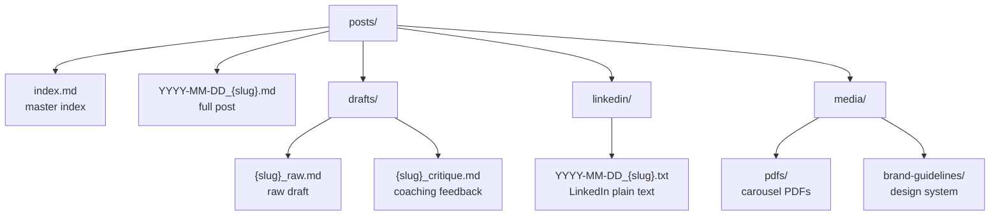
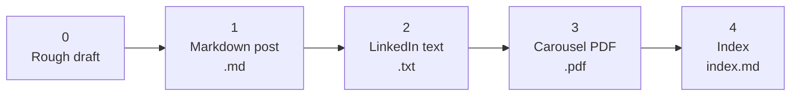

# {{SERIES_TITLE}}

A personal archive of weekly {{TOPIC_DOMAIN}} practice problems posted on [LinkedIn]({{LINKEDIN_PROFILE_URL}}). Problems are sourced from {{CONTENT_SOURCES}}.

## Structure

```
posts/
├── index.md                  # Full post index (chronological, oldest first)
├── YYYY-MM-DD_{slug}.md      # One file per post
├── drafts/
│   ├── {slug}_raw.md         # Raw draft exactly as written (any language)
│   └── {slug}_critique.md    # Coaching feedback on the raw draft
├── linkedin/
│   └── YYYY-MM-DD_{slug}.txt # LinkedIn-copyable plain text version
└── media/
    ├── pdfs/                 # LinkedIn carousel PDFs
    └── brand-guidelines/     # {{BRAND_NAME}} design system
```



## Posts

0 posts archived.

→ [View full post index](posts/index.md)

| Range | Topics |
|-------|--------|
| — | — |

## Workflow

Each post follows this sequence:



**0. Write and save a rough draft** (`posts/drafts/{slug}_raw.md`)

Write in any language, any format. The draft gets saved as-is, then reviewed for: hook angle, content correctness, logic precision, insight framing, and takeaway quality. Coaching feedback is saved to `posts/drafts/{slug}_critique.md` before the final post is written.

**1. Write the markdown post** (`posts/YYYY-MM-DD_{slug}.md`)

Standard sections: Problem, {{SECTION_1_TITLE}}, {{SECTION_2_TITLE}}, {{SECTION_3_TITLE}}, {{SECTION_4_TITLE}}. Header emoji is {{HEADER_EMOJI}}.

**2. Write the LinkedIn plain text** (`posts/linkedin/YYYY-MM-DD_{slug}.txt`)

No markdown syntax. Uses `→` for bullets, `•` for lists, `─────` dividers, bold Unicode for section headers.

**3. Generate the carousel PDF** (`posts/media/pdfs/YYYY-MM-DD_{slug}.pdf`)

Generated with Python + matplotlib using the {{BRAND_NAME}} design system. Generator scripts saved to `/tmp/gen_{slug}.py`.

**4. Update the index** (`posts/index.md`)

Append a new row. Index is chronological (oldest = #1). Posted date is decoded from the LinkedIn URN (`urn >> 22` gives Unix ms timestamp). Leave as `—` if the URN is unknown.

## Design System

All carousels use the **{{BRAND_NAME}}** brand: {{COLOR_GROUND_NAME}} background (`{{COLOR_GROUND_HEX}}`), {{COLOR_ACCENT_NAME}} accent (`{{COLOR_ACCENT_HEX}}`), {{FONT_DISPLAY}} display type, {{FONT_BODY}} body, {{FONT_CODE}} for code. Full spec in `posts/media/brand-guidelines/brand-guidelines.md`.
