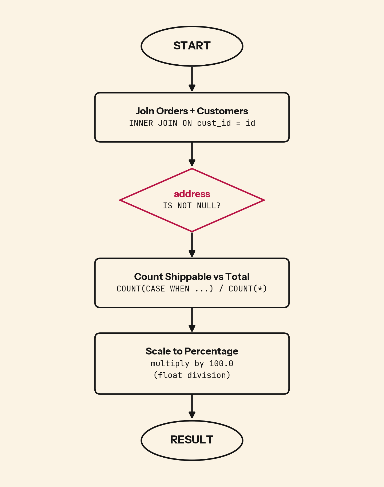

A paid order is not always a shippable order.

## 💻 SQL of the Day: Percentage of Shipable Orders
🏷️ Difficulty: Easy | ⚙️ Dialect: PostgreSQL
🔗 Source: https://platform.stratascratch.com/coding/10090-find-the-percentage-of-shipable-orders?code_type=1

### 📝 The Problem:
Find what percentage of orders can actually be shipped by checking whether each customer's address is available.

---

### 🧠 SQL Solution:
```sql
SELECT
    100.0
    * COUNT(CASE WHEN c.address IS NOT NULL THEN 1 END)
    / COUNT(*) AS percent_shipable
FROM orders AS o
INNER JOIN customers AS c
    ON o.cust_id = c.id;
```

**Alternative approach using AVG:**
```sql
SELECT
    AVG((address IS NOT NULL)::INT) * 100 AS percent_shipable
FROM orders
INNER JOIN customers
    ON customers.id = orders.cust_id;
```

---

### 🧩 Logic Breakdown:
* **Step 1:** Join `orders` with `customers` so every order can be checked against the customer's address record.
* **Step 2:** Use `CASE WHEN address IS NOT NULL THEN 1 END` to count only orders with valid addresses.
* **Step 3:** Divide by `COUNT(*)` (total orders) and multiply by 100 to get the percentage. The `100.0` ensures floating-point division.

**Why the alternative AVG approach works:**
- `AVG((condition)::INT)` automatically calculates the ratio of true values (1) to total rows
- Mathematically equivalent: AVG of 1s and 0s = COUNT(1s) / COUNT(all)
- More concise but less explicit about what's being counted



Editorial note: [percentage_of_shipable_orders_note.md](drafts/percentage_of_shipable_orders_note.md)

---

### 📊 Business Impact (Why this matters):
* **Fulfillment readiness:** Orders without addresses may look valid in the order table, but operations teams cannot ship them.
* **Cost control:** Measuring shippability early helps teams avoid wasted picking, packing, routing, and customer support work.

---

### 🎯 Key Takeaways:

* Use `COUNT(CASE WHEN ... THEN 1 END) / COUNT(*)` for explicit percentage calculations where the numerator and denominator are clear.
* The `100.0` (not `100`) ensures floating-point division in SQL, preventing integer truncation.
* Alternative: `AVG((condition)::INT) * 100` is more concise but less explicit about what's being counted.

---

💬 **Over to you: Would you solve this differently? Drop your approach or alternative queries in the comments below! 👇**

#SQLoftheDay #SQL #StrataScratch #DataAnalytics #BusinessIntelligence #SupplyChainAnalytics
