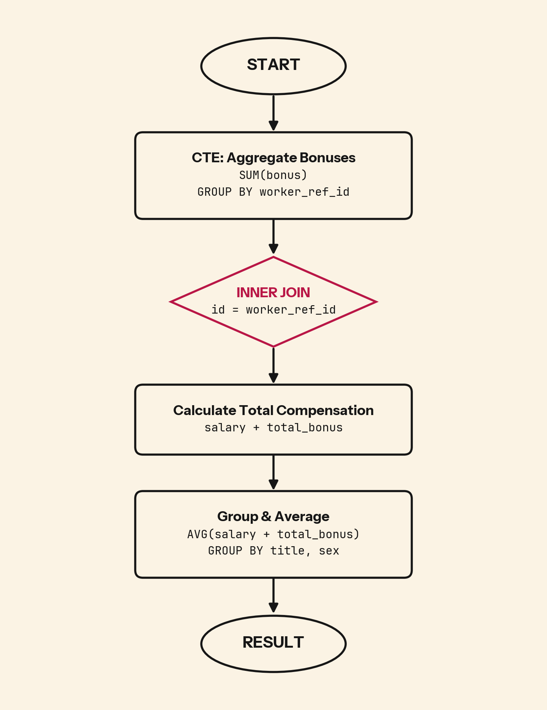

Compensation equity audits fail when you measure the wrong population. Here's how to calculate average total compensation by title and gender while correctly handling employees with multiple bonuses.

## 💻 SQL of the Day: Income By Title and Gender
🏷️ Difficulty: Medium | ⚙️ Dialect: PostgreSQL
🔗 https://platform.stratascratch.com/coding/10077-income-by-title-and-gender?code_type=1

### 📝 The Problem:
Find the average total compensation based on employee titles and gender. Total compensation is calculated by adding both the salary and bonus of each employee. However, not every employee receives a bonus so disregard employees without bonuses in your calculation. Employees can receive more than one bonus. Output the employee title, gender (i.e., sex), along with the average total compensation.

---

### 🧠 SQL Solution:
```sql
WITH cte_total_bonus AS (
    SELECT
        worker_ref_id,
        SUM(bonus) AS total_bonus
    FROM sf_bonus
    GROUP BY worker_ref_id
)
SELECT
    e.employee_title,
    e.sex,
    AVG(e.salary + b.total_bonus) AS average_compensation
FROM sf_employee e
INNER JOIN cte_total_bonus b
    ON e.id = b.worker_ref_id
GROUP BY 1, 2;
```

---

### 🧩 Logic Breakdown:
* **Step 1:** Aggregate all bonuses per employee first using `SUM(bonus) GROUP BY worker_ref_id` to handle employees with multiple bonus records
* **Step 2:** `INNER JOIN` filters out employees without bonuses automatically (only employees in the bonus table remain)
* **Step 3:** Calculate average of `salary + total_bonus` grouped by title and gender



---

### 📊 Business Impact (Why this matters):
* **Pay-equity exposure:** Average comp by title and gender is the first screen for a pay gap that carries legal and retention risk if ignored.
* **The average can hide it:** Two roles can share a mean while one masks a wide spread, so an equity call made on the average alone can clear a gap that is really there.
* **Benchmarking:** Role averages compared against market data flag where pay sits below market and retention risk is quietly building.

---

### 🎯 Key Takeaways:

1. When employees can have multiple bonus records, aggregate bonuses first in a CTE before joining to avoid inflating salary values through row multiplication
2. `INNER JOIN` on the bonus table automatically excludes employees without bonuses (no need for `WHERE bonus IS NOT NULL`)
3. Averages compress distribution. For equity audits, also measure quartiles using `percentile_cont()` to see the full compensation spread

---

💬 **Over to you: Would you solve this differently? Drop your approach or alternative queries in the comments below! 👇**

#SQLoftheDay #SQL #StrataScratch #DataAnalytics #DataEngineering #PostgreSQL
