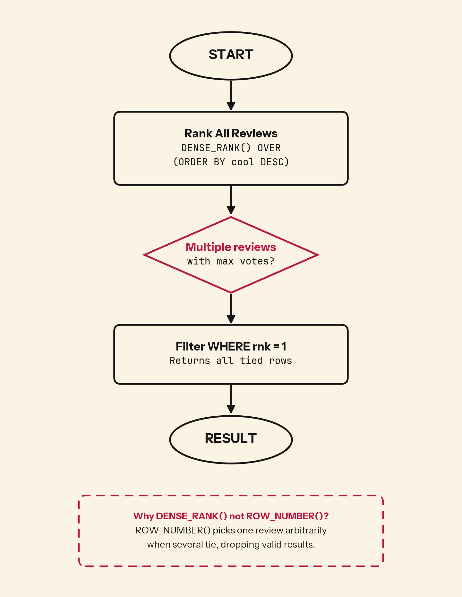

When two reviews tie for the highest score, which one should your platform surface? The wrong ranking function silently drops one with no warning.

## 💻 SQL of the Day: Top Cool Votes
🏷️ Difficulty: Medium | ⚙️ Dialect: PostgreSQL
🔗 https://platform.stratascratch.com/coding/10060-top-cool-votes?code_type=1

### 📝 The Problem:
Find the review text that received the highest number of cool votes. Return the business name and the review text.

---

### 🧠 SQL Solution:
```sql
WITH rank_list AS (
    SELECT
        business_name,
        review_text,
        cool,
        DENSE_RANK() OVER (ORDER BY cool DESC) AS rnk
    FROM yelp_reviews
)

SELECT
    business_name,
    review_text
FROM rank_list
WHERE rnk = 1;
```

---

### 🧩 Logic Breakdown:
* **Step 1:** `DENSE_RANK() OVER (ORDER BY cool DESC)` assigns rank 1 to all reviews with the maximum cool votes
* **Step 2:** Ties share the same rank (two reviews with 10 cool votes both get rank 1, not rank 1 and rank 2)
* **Step 3:** `WHERE rnk = 1` returns every review at the top position



---

### 📊 Business Impact (Why this matters):
* **Content discovery:** Platforms surface "top" content with queries like this. Drop a tie and a valid recommendation never reaches users.
* **Earned visibility:** A tied business loses visibility it earned, and the product ends up recommending less-liked content while looking correct.
* **Editorial trust:** A "most loved review" feature that shows one of several tied winners looks arbitrary the moment a reader spots an equal review left out.

---

### 🎯 Key Takeaways:

1. `ROW_NUMBER()` assigns unique numbers regardless of ties (1, 2, 3, 4) and silently drops valid data when filtering for top results
2. `RANK()` allows ties but skips ranks (1, 1, 3, 4). Use for competitive rankings where position matters.
3. `DENSE_RANK()` allows ties with no gaps (1, 1, 2, 3). Use when you need "all rows with the maximum value" without caring about position numbers.

---

💬 **Over to you: Would you solve this differently? Drop your approach or alternative queries in the comments below! 👇**

#SQLoftheDay #SQL #StrataScratch #DataAnalytics #DataAnalyst #WindowFunctions #Ranking #Yelp
