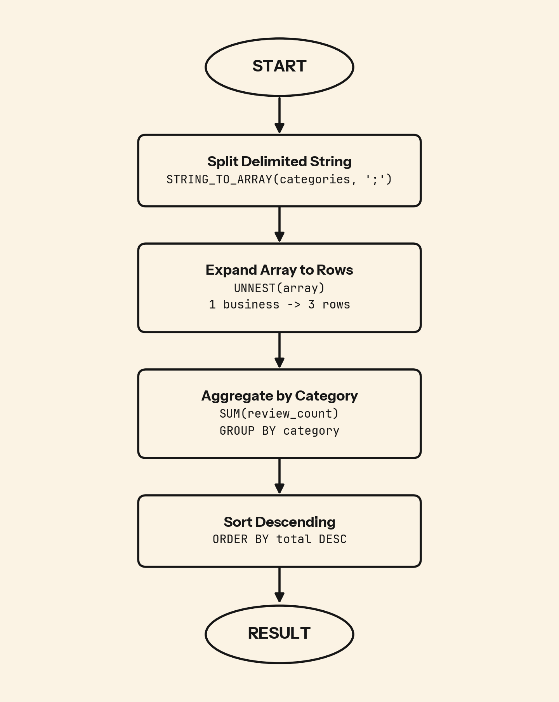

A business listed under "Restaurants;Bars;Nightlife" contributes to three categories simultaneously. Running GROUP BY on that string treats it as one opaque value and miscounts everything.

## 💻 SQL of the Day: Reviews of Categories
🏷️ Difficulty: Medium | ⚙️ Dialect: PostgreSQL
🔗 https://platform.stratascratch.com/coding/10049-reviews-of-categories?code_type=1

### 📝 The Problem:
Find the total number of reviews for each business category in the Yelp dataset. Return the category name and the total review count, ordered from highest to lowest.

---

### 🧠 SQL Solution:
```sql
WITH split_category AS (
    SELECT
        UNNEST(STRING_TO_ARRAY(categories, ';')) AS category,
        review_count
    FROM yelp_business
)

SELECT
    category,
    SUM(review_count) AS no_of_reviews
FROM split_category
GROUP BY 1
ORDER BY 2 DESC;
```

---

### 🧩 Logic Breakdown:
* **Step 1:** `STRING_TO_ARRAY(categories, ';')` splits the semicolon-delimited string into a PostgreSQL array
* **Step 2:** `UNNEST(...)` expands that array into individual rows. One business with three categories becomes three rows, each carrying the original review_count
* **Step 3:** `SUM(review_count) GROUP BY category` aggregates across all exploded rows, giving each category its total review weight



---

### 📊 Business Impact (Why this matters):
* **Category demand at a glance:** Totals per category show which segments (Restaurants, Bars, Nightlife) pull the most engagement, so marketing and partnerships know where to invest.
* **Cross-listed segments get undercounted:** A business in three categories should feed all three. Miss the split and your "top category" report quietly understates the segments that span the most businesses.
* **Curation priorities:** Categories with low review counts surface where the catalog is thin or mistagged and needs editorial attention.

---

### 🎯 Key Takeaways:

1. When a column stores multiple values as a delimited string, `GROUP BY` on that column will miscount. Split first, then aggregate.
2. In PostgreSQL, use `STRING_TO_ARRAY` to convert the string to an array, then `UNNEST` to expand that array into rows. Each function has one job and they cannot be swapped.
3. This pattern applies to any system storing multi-value data in a single column: product tags, user roles, content genres, permission sets.

---

💬 **Over to you: Would you solve this differently? Drop your approach or alternative queries in the comments below! 👇**

#SQLoftheDay #SQL #StrataScratch #DataAnalytics #DataAnalyst #PostgreSQL #StringFunctions #Yelp
