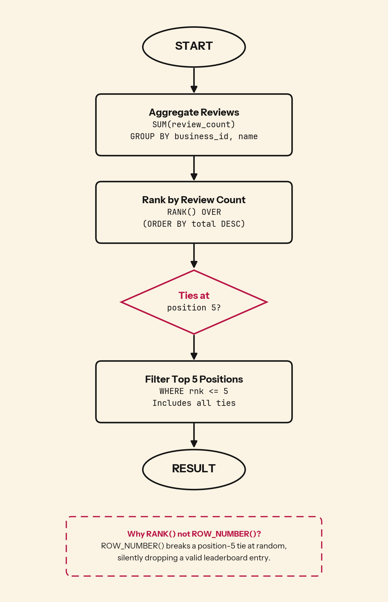

When two businesses tie for 5th place with identical review counts, does your query return both or arbitrarily pick one? The wrong approach silently drops valid leaderboard entries.

## 💻 SQL of the Day: Top Businesses with Most Reviews
🏷️ Difficulty: Medium | ⚙️ Dialect: PostgreSQL
🔗 https://platform.stratascratch.com/coding/10048-top-businesses-with-most-reviews?code_type=1

### 📝 The Problem:
Find the top 5 businesses with the most reviews. Return the business name and total review count.

---

### 🧠 SQL Solution:
```sql
WITH business_rank AS (
    SELECT
        business_id,
        name,
        SUM(review_count) AS review_count,
        RANK() OVER (ORDER BY SUM(review_count) DESC) AS rnk
    FROM yelp_business
    GROUP BY business_id, name
)

SELECT name, review_count
FROM business_rank
WHERE rnk <= 5;
```

---

### 🧩 Logic Breakdown:
* **Step 1:** `SUM(review_count) GROUP BY business_id, name` aggregates total reviews per business
* **Step 2:** `RANK() OVER (ORDER BY ... DESC)` assigns position based on descending review count. Two businesses with the same total both receive rank 3, and the next rank assigned is 5 (not 4)
* **Step 3:** `WHERE rnk <= 5` keeps every business within the top 5 positions, including all tied entries at the boundary



---

### 📊 Business Impact (Why this matters):
* **Fair leaderboards:** If two businesses tie for 5th, dropping one makes a business that earned its spot vanish from a ranking customers and partners actually see.
* **Spend follows the list:** Featured placement and partnership outreach get aimed at this top 5, so a silently truncated leaderboard points budget at the wrong accounts.
* **Competitive signal:** A business tracking its own rank needs to know when it is tied with a rival, not just its raw position.

---

### 🎯 Key Takeaways:

1. `ROW_NUMBER()` silently corrupts any top-N query where ties are possible. It produces clean output with no warning, just an incomplete leaderboard.
2. `RANK()` is the correct default for competitive rankings: tied businesses share the same position and the count skips ahead, so `<= 5` reliably returns all entries that belong in the top 5.
3. `DENSE_RANK()` is not a safe upgrade from `RANK()` for top-N filters. It can expand your result set beyond N rows when ties exist, because compressed numbering allows lower-ranked entries to squeeze into the filter range.

---

💬 **Over to you: Would you solve this differently? Drop your approach or alternative queries in the comments below! 👇**

#SQLoftheDay #SQL #StrataScratch #DataAnalytics #DataAnalyst #WindowFunctions #Ranking #Yelp
