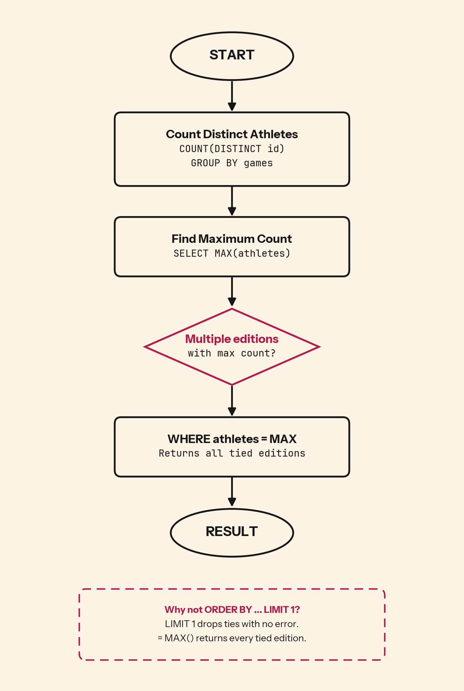

Olympic attendance fluctuates with boycotts, host politics, and global participation. If two editions tie for the highest athlete count, does your query show both or flip a coin?

## 💻 SQL of the Day: Largest Olympics
🏷️ Difficulty: Medium | ⚙️ Dialect: PostgreSQL
🔗 https://platform.stratascratch.com/coding/9942-largest-olympics?code_type=1

### 📝 The Problem:
Find the Olympics with the most distinct athletes. Return the name of the edition and the number of distinct athletes.

---

### 🧠 SQL Solution:
```sql
WITH Olymp AS (
  SELECT games, COUNT(DISTINCT id) AS athletes
  FROM olympics_athletes_events
  GROUP BY games
)
SELECT *
FROM Olymp
WHERE athletes = (
  SELECT MAX(athletes)
  FROM Olymp
);
```

---

### 🧩 Logic Breakdown:
* **Step 1:** `COUNT(DISTINCT id) GROUP BY games` counts unique athlete IDs per edition. One athlete competing in three events within the same Olympics is still one person.
* **Step 2:** Subquery `SELECT MAX(athletes) FROM Olymp` returns the single highest count across all editions
* **Step 3:** `WHERE athletes = (SELECT MAX(...))` keeps every edition matching that peak count, including any ties



---

### 📊 Business Impact (Why this matters):
* **Records get quoted:** "Most-attended Games" lands in media, sponsor decks, and planning models. If two editions tie and you publish one, the record is a coin flip.
* **Capacity planning:** Host cities size venues and budgets off historical highs, so missing a tied peak understates the real ceiling.
* **Trend analysis:** Comparing the largest edition across decades only holds up if every tied peak is counted, or the growth story rests on an arbitrary pick.

---

### 🎯 Key Takeaways:

1. Use `COUNT(DISTINCT id)` when entities can appear in multiple rows. Counting rows overcounts people; counting distinct IDs counts people.
2. Prefer conditional equality (`= (SELECT MAX(...))`) over `ORDER BY + LIMIT 1` for top-value queries. The latter silently discards ties.
3. `LIMIT 1` is not a bug detector. It returns clean output even when it drops valid data. The only way to catch it is to know ties are possible before you write the query.

---

💬 **Over to you: Would you solve this differently? Drop your approach or alternative queries in the comments below! 👇**

#SQLoftheDay #SQL #StrataScratch #DataAnalytics #DataAnalyst #Olympics
