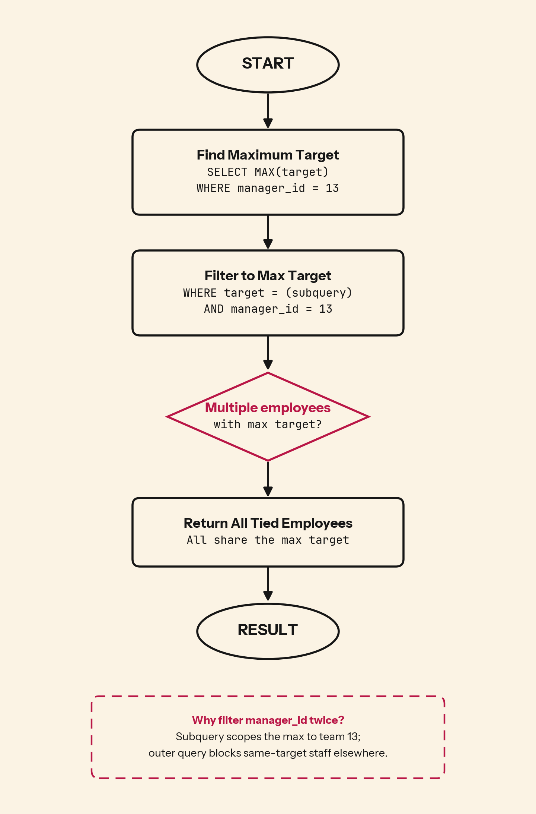

When multiple salespeople tie for the highest target under the same manager, does your query show all of them or arbitrarily pick one for the performance report?

## 💻 SQL of the Day: Highest Target Under Manager
🏷️ Difficulty: Easy | ⚙️ Dialect: PostgreSQL
🔗 https://platform.stratascratch.com/coding/9905-highest-target-under-manager?code_type=1

### 📝 The Problem:
Find the first name and target of the Salesforce employee with the highest target among those reporting to manager_id = 13.

---

### 🧠 SQL Solution:
```sql
SELECT first_name, target
FROM salesforce_employees
WHERE target = (
    SELECT MAX(target)
    FROM salesforce_employees
    WHERE manager_id = 13
)
AND manager_id = 13;
```

---

### 🧩 Logic Breakdown:
* **Step 1:** Subquery `SELECT MAX(target) WHERE manager_id = 13` returns the single highest target value among all employees under this manager
* **Step 2:** Outer query filters to `target = (...)` to find all employees whose target matches that maximum value
* **Step 3:** Manager filter applied twice (subquery and outer query) ensures we only look at the right team and don't match employees from other teams who happen to have the same target value



---

### 📊 Business Impact (Why this matters):
* **Performance visibility:** See who carries the heaviest quota and may need support.
* **Compensation equity:** When several people tie at the top, HR can check that pay and recognition match the workload.
* **Capacity planning:** Knowing the ceiling target sets realistic expectations when onboarding new reps or rebalancing the team.

---

### 🎯 Key Takeaways:

1. Use `MAX()` in a subquery to find the boundary value, then filter the main table to match that value. This preserves ties that `ORDER BY ... LIMIT 1` would discard.
2. When filtering to a specific group (like a manager's team), apply the filter in both the subquery and outer query to avoid cross-contamination from other groups.
3. `MAX()` is deterministic and clear. `LIMIT 1` without `ORDER BY` returns arbitrary rows. `ORDER BY` with `LIMIT 1` drops ties. The subquery pattern is the only way to capture all top performers.

---

💬 **Over to you: Would you solve this differently? Drop your approach or alternative queries in the comments below! 👇**

#SQLoftheDay #SQL #StrataScratch #DataAnalytics #DataAnalyst #Subqueries #Salesforce #PerformanceManagement
