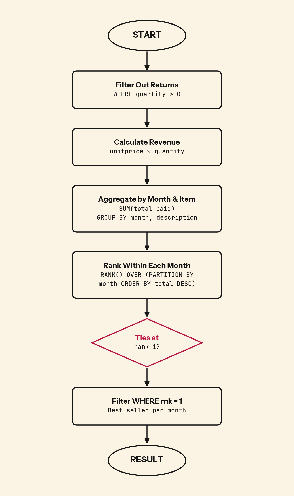

Negative quantities in transactional data are refunds, not sales. Without filtering them out, a heavily-returned item can rank first by revenue magnitude and break your entire monthly report.

## 💻 SQL of the Day: Best Selling Item
🏷️ Difficulty: Medium | ⚙️ Dialect: PostgreSQL
🔗 https://platform.stratascratch.com/coding/10172-best-selling-item?code_type=1

### 📝 The Problem:
Find the best-selling item for each month (no need to separate months by year) where the biggest total invoice amount was paid. Output the month, item description, and total paid.

---

### 🧠 SQL Solution:
```sql
WITH raw AS (
    SELECT
        EXTRACT(MONTH FROM invoicedate) AS month,
        description,
        unitprice * quantity AS total_paid
    FROM online_retail
    WHERE quantity > 0
),

agg AS (
    SELECT
        month,
        description,
        SUM(total_paid) AS total_paid
    FROM raw
    GROUP BY month, description
),

ranked AS (
    SELECT
        month,
        description,
        total_paid,
        RANK() OVER (PARTITION BY month ORDER BY total_paid DESC) AS rnk
    FROM agg
)

SELECT month, description, total_paid
FROM ranked
WHERE rnk = 1;
```

---

### 🧩 Logic Breakdown:
* **Step 1:** `WHERE quantity > 0` removes returns (negative quantities are refunds in transactional datasets)
* **Step 2:** `unitprice * quantity` computes revenue per transaction row
* **Step 3:** `SUM(total_paid) GROUP BY month, description` aggregates to total revenue per item per month
* **Step 4:** `RANK() OVER (PARTITION BY month ...)` assigns position 1 to the highest-revenue item each month and preserves ties
* **Step 5:** `WHERE rnk = 1` returns the monthly winner, or winners if tied



---

### 📊 Business Impact (Why this matters):
* **Inventory planning:** Spot which items peak in which months and pre-order stock before demand arrives.
* **Margin:** If an item already leads the month, a discount cuts margin without adding demand.
* **Seasonal strategy:** Items that top the chart every year separate from one-time spikes, which shapes what stays in the core range.

---

### 🎯 Key Takeaways:

1. Define "best-selling" before writing the query. Revenue and units sold can return completely different winners. The business question determines which metric you need.
2. `WHERE quantity > 0` is not a convenience filter. It removes returns. Without it, a heavily-returned item can rank first by revenue magnitude.
3. `RANK()` preserves ties. `ORDER BY ... LIMIT 1` picks one row arbitrarily when two items tie. The report looks complete but is not.

---

💬 **Over to you: Would you solve this differently? Drop your approach or alternative queries in the comments below! 👇**

#SQLoftheDay #SQL #StrataScratch #DataAnalytics #WindowFunctions #Ranking #RetailAnalytics
