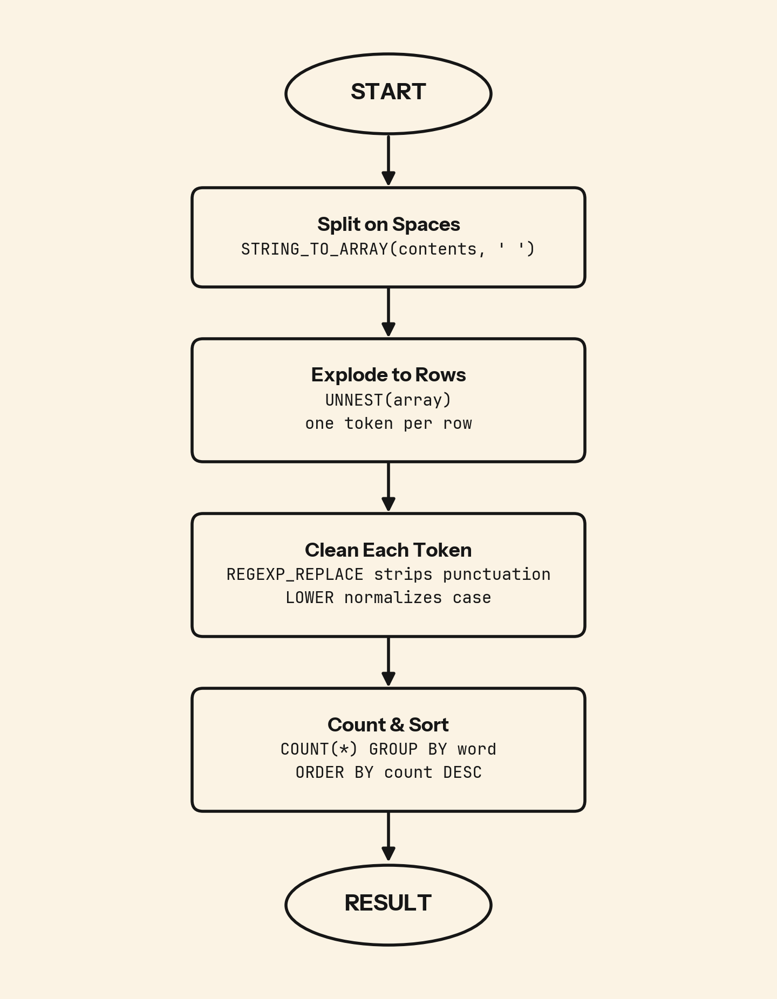

Skip one cleaning step and "word." and "word" become two separate rows. Your top-words report quietly fragments at every sentence boundary.

## 💻 SQL of the Day: Word Count in Drafts
🏷️ Difficulty: Medium | ⚙️ Dialect: PostgreSQL
🔗 https://platform.stratascratch.com/coding/9817-find-the-number-of-times-each-word-appears-in-drafts?code_type=1

### 📝 The Problem:
Find the number of times each word appears across all drafts in google_file_store. Output each word and its count, ordered by frequency descending.

---

### 🧠 SQL Solution:
```sql
WITH raw AS (
    SELECT LOWER(
               REGEXP_REPLACE(word, '[^a-zA-Z0-9]', '', 'g')
           ) AS word
    FROM google_file_store,
         UNNEST(STRING_TO_ARRAY(contents, ' ')) AS word
)
SELECT word, COUNT(*) AS occurrences
FROM raw
GROUP BY word
ORDER BY 2 DESC;
```

---

### 🧩 Logic Breakdown:
* **Step 1:** `STRING_TO_ARRAY(contents, ' ')` splits each draft into tokens on spaces, then `UNNEST(...)` explodes the array so every token becomes its own row.
* **Step 2:** `REGEXP_REPLACE(word, '[^a-zA-Z0-9]', '', 'g')` strips punctuation so `"word."` and `"word"` stop counting as two entries, and `LOWER(...)` folds case so `"Draft"` and `"draft"` collapse into one.
* **Step 3:** `COUNT(*) GROUP BY word` aggregates the cleaned tokens, and `ORDER BY 2 DESC` ranks them by frequency.



---

### 📊 Business Impact (Why this matters):
* **Voice of the corpus:** Word frequency surfaces the vocabulary a team actually uses, exposing the themes that dominate the drafts rather than the ones leadership assumes are there.
* **Cheap signal before ML:** A corpus where "blocked", "issue", or "pending" ranks near the top flags risk and sentiment before anyone builds a model.
* **Document health:** Drafts heavy with hedge words like "maybe", "consider", and "pending" point to unresolved decisions, not finished work.

---

### 🎯 Key Takeaways:

1. Clean before you split. `REGEXP_REPLACE` on the token is predictable, but punctuation that runs into the next word with no space survives the split, so normalize deliberately.
2. `LOWER()` and `REGEXP_REPLACE()` together are the minimum viable normalization for any word-frequency task. Either one alone still fragments the counts.
3. Word frequency is a proxy for attention. What people write most is what they are actually thinking about, whatever the document is supposed to cover.

---

💬 **Over to you: Would you solve this differently? Drop your approach or alternative queries in the comments below! 👇**

#SQLoftheDay #SQL #StrataScratch #DataAnalytics #TextAnalytics #StringProcessing #NLP
